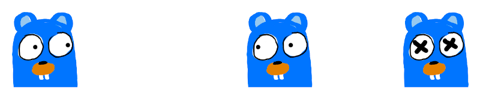

# whac-a-gopher: Simple game written in Go

This is an example project for my speak in `devfestW Korea 2013`
which is about Go's power of handling concurrency.

> original source which use SDL1 stored in `topic-sdl1` branch

* [Live demo](https://suapapa.github.io/whac-a-gopher)
* [Video(youtube)](http://youtu.be/fqvJWG4cWIg) - SDL1 version

## How to build and run

Tested with `Go 1.14`.

Download:

    git clone https://github.com/suapapa/whac-a-gopher

Buind and run:

    make

